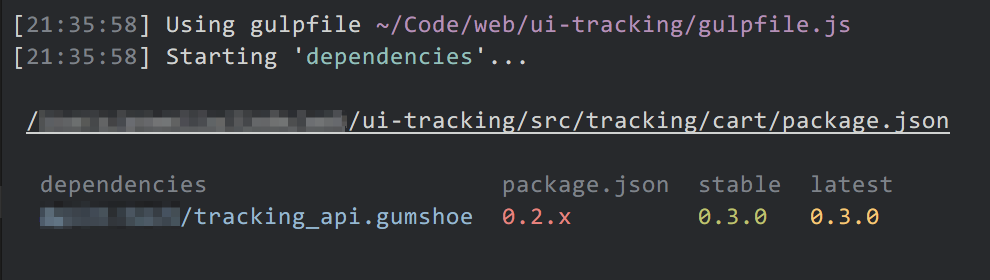

# gulp-david-stylish [](https://travis-ci.org/shellscape/gulp-david-stylish)
> A stylish reporter for the gulp-david Gulp plugin



## Installing

The reporter can be installed via NPM:

```bash
npm install gulp-david-stylish --save-dev
```

## Usage

Setup is rather easy. Please refer to the [gulp-david](https://github.com/cedx/gulp-david)
documentation for getting started with the plugin. To use gulp-david-stylish,
use the following pattern, or similar:

```js
const { david } = require('@cedx/gulp-david');
const stylish = require('gulp-david-stylish');

gulp.task('deps', (done) => {

  const glob = [
    'package.json',
    '!node_modules'
  ];

  gulp.src(glob)
    .pipe(david({
      reporter: new stylish.Reporter(done)
    }));
});
```

This breaks from reporter export styles such as jshint-stylish, but follows the
patterns set in the [default reporter](https://github.com/cedx/gulp-david/blob/master/src/reporter.js)
of gulp-david.

You'll notice that we're using a gulp task callback with the `done` parameter.
That parameter is a function which lets gulp know a task is complete. Contrary
to just returning the stream, using the `done` callback will block a task from
finishing until it's called. Since gulp-david [runs the david module async](https://github.com/cedx/gulp-david/issues/12)
the task will finish before the reporter has an opportunity to display the results.
To combat this (until or if gulp-david is modified) we can pass the `done`
callback to `gulp-david-stylish` which will call the function when the reporter
has completed logging the results.
